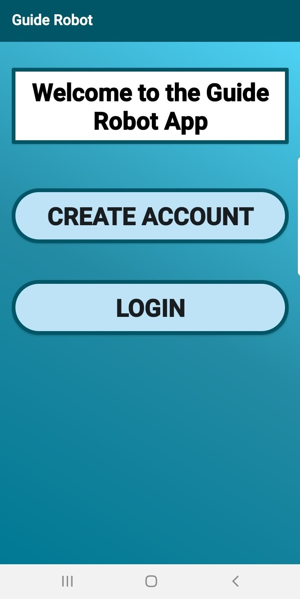
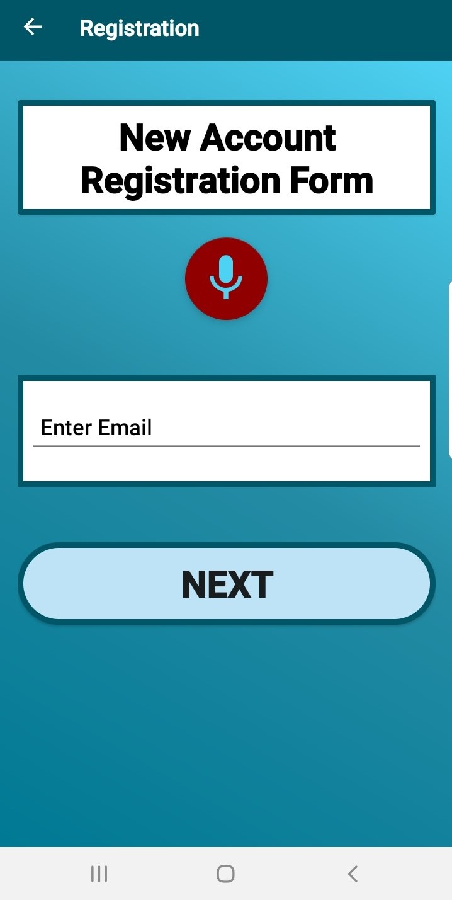
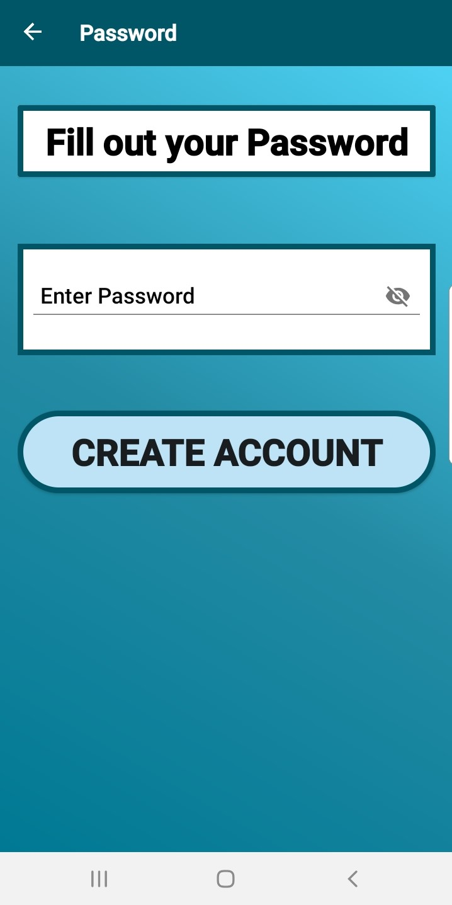
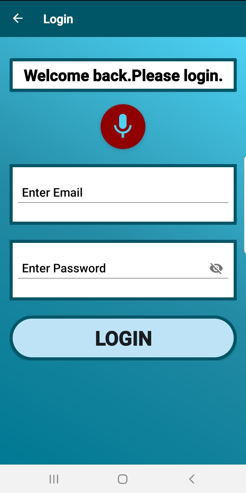
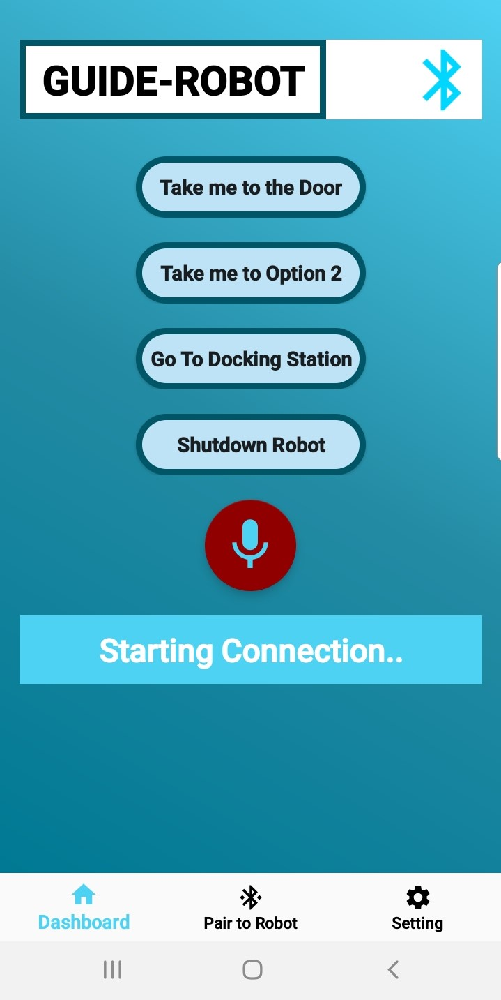
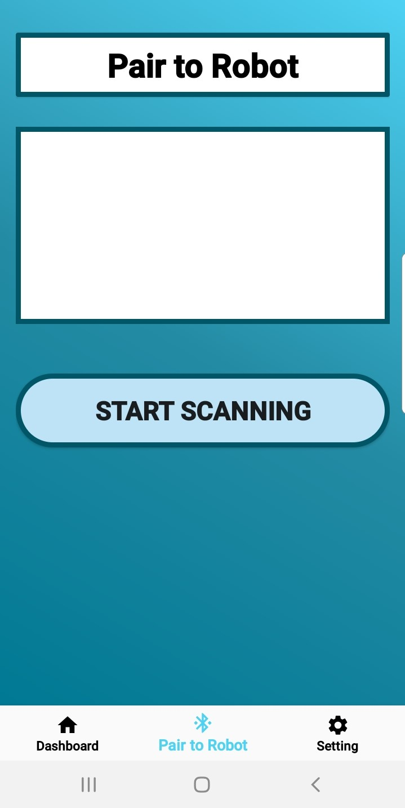

# Guide Robot App

> Android Application created following the guidelines for implementing key elements of accessibility so that visually impaired users can successfully utilize the app.

The application connects to a Jetson Nano and controls the movement of a Turtlebot2. The app creates a connection using Bluetooth Sockets. Users can choose between the predefined destinations in the UI. Then, this command is sent to the Jetson Nano, and the navigation stack of the Turtlebot2 starts.

## Result

